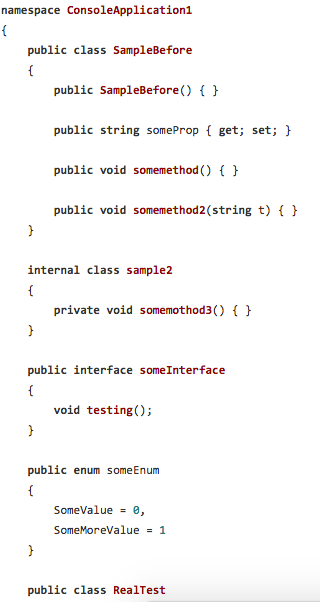
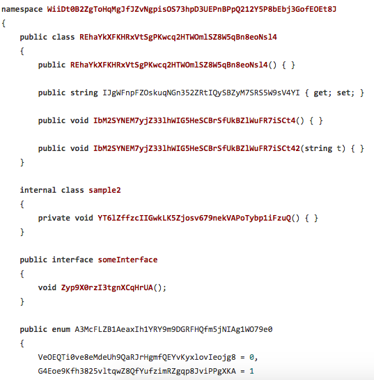

# CodeMixer

###Background
This is one of these projects that I put together form an idea form speaking to someone over at the coffee machine.

Where they say I wish.... 

When we encrypt our code I wish that all the public interfaces got renamed as well in all source files to make it harder for someone to understand whats going on in the code.

After a bit of thinking I cam up this as an idea and it works well for our code base.

###How It Works
The tool looks in the directory you give to find C# files, then it reads all the files to find all the methods, class names ect. The tool then generates a random name for each item and finds that name in all source files and then replaces the item with the new random name.

###Help out
If you want to help out please free, at some stage I would like to try and add VB.Net and C++

###Examples
Before

After

